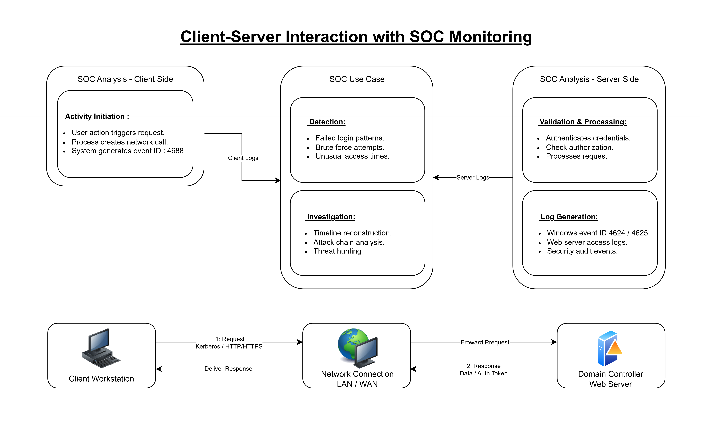

# Client vs Server

## Description
Enterprise networks are built around the **client–server model**, where systems have defined roles. A client initiates communication by requesting a service or resource, while a server listens for requests, processes them, and sends back responses. This model is fundamental to authentication, web services, file sharing, and security monitoring.

For SOC analysts, most alerts and investigations are rooted in understanding how clients and servers interact.

---

## Core Concept
A **client** is a system or application that requests services.
Examples include:
- User workstations
- Web browsers
- Endpoint agents

A **server** is a system designed to provide services to multiple clients.
Examples include:
- Domain Controllers
- Web servers
- File servers
- SIEM and log servers

Communication flow:
1. Client sends a request
2. Server processes the request
3. Server sends a response

This interaction uses defined protocols such as HTTP/HTTPS, SMB, LDAP, Kerberos, and DNS.

---

## SOC Relevance
In a SOC environment:
- Clients are commonly the **origin of activity**
- Servers are often the **primary log sources**
- Attacks typically move from client to server or abuse server trust

Common scenarios include:
- Failed logins from a client to a domain controller
- Malware on a client contacting a remote command and control server
- Unauthorized client access attempts against internal servers
- High request volume causing server performance or availability issues

Identifying the client and server roles helps analysts determine attack direction, scope, and impact.

---

## Common Security Events
- Authentication failures
- Access denied responses
- Abnormal request frequency
- Suspicious outbound connections from clients

---

## Summary
The client–server model explains how systems communicate across a network. For SOC analysts, understanding this relationship is essential for log analysis, alert triage, and incident investigation.

## Client vs Server Diagram:

